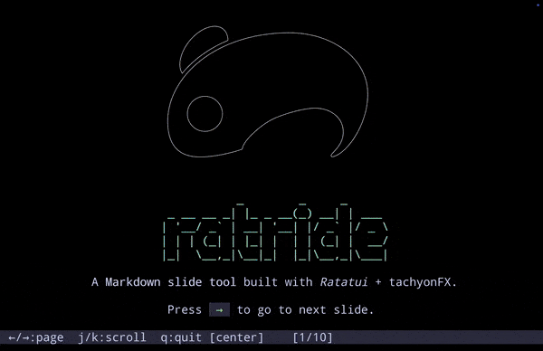

<div align="center">
    
    <h1>ratride</h1>
</div>

A tiny slide presenter built with [ratatui](https://github.com/ratatui/ratatui).

## Features

- Markdown-based slides (`---` delimiter)
- Layouts: default, center, two-column
- Slide transitions (fade, dissolve, sweep, etc.)
- Image display (iTerm2 / Kitty / Sixel)

## Install

```
cargo install ratride
```

## Usage

```
ratride slides.md
```

## Not supported

Ratride DOES NOT supported following fetures:

- Syntax highlighting
- Code execution
- Mermaid / LaTeX / Typst rendering
- Themes & custom styling
- Speaker notes
- PDF / HTML export
- Incremental reveal (`pause`)
- Hot reload

If you need any of them, I recommend [presenterm](https://github.com/mfontanini/presenterm):


## LICENSE
MIT

## Author

AMAGI (https://amagi.dev/)
