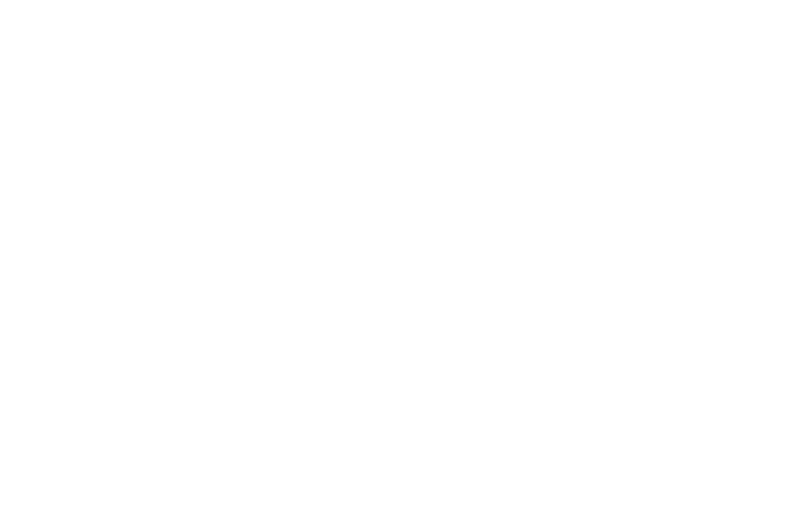

<!-- layout: center -->
<!-- figlet -->



# ratride

A **Markdown slide tool** built with *Ratatui* + tachyonFX.

Press `→` to go to next slide.

---

<!-- transition: fade -->

## Features

- Parse Markdown and render in terminal
- Scroll with `j`/`k` keys
- **Bold**, *Italic*, ~~Strikethrough~~
- `inline code` support
- Page navigation with `←`/`→`
- Per-slide layouts & transitions


---

<!-- layout: two-column -->
<!-- transition: sweep-in -->

## Left Column

- Item A
- Item B
- Item C

|||

## Right Column

1. First
2. Second
3. Third

---

<!-- transition: coalesce -->

## Code Block

```rust
fn main() {
    println!("Hello, world!");
}
```

> This is a blockquote.

---

<!-- transition: lines -->

## Lines Transition

This slide uses the **lines** transition.

Each line is revealed left-to-right with staggered timing.

---

<!-- transition: lines-cross -->

## Lines-Cross Transition

This slide uses the **lines-cross** transition.
Even lines reveal left-to-right, odd lines right-to-left.
Even lines reveal left-to-right, odd lines right-to-left.
Even lines reveal left-to-right, odd lines right-to-left.
Even lines reveal left-to-right, odd lines right-to-left.

---

<!-- transition: slide-rgb -->

## Slide-RGB Transition

This slide uses the **slide-rgb** transition.

A color-cycling leading edge sweeps from left to right.

---

<!-- transition: lines-rgb -->

## Lines-RGB Transition

This slide uses the **lines-rgb** transition.

Hey Hey Yo Yo.

---

<!-- layout: center -->
<!-- transition: dissolve -->

# Thank you!

That's all for the demo.
